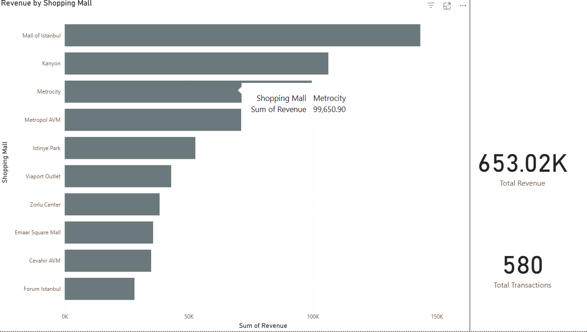
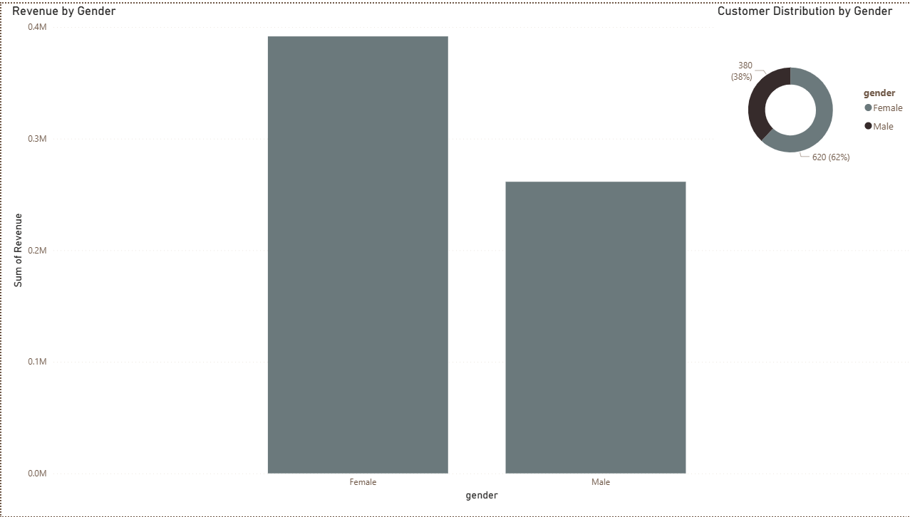
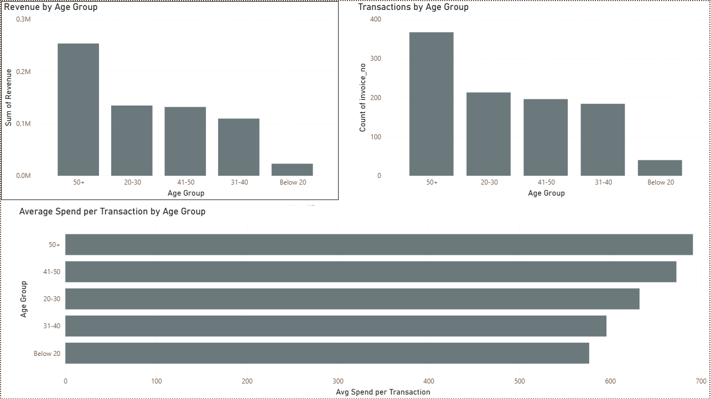
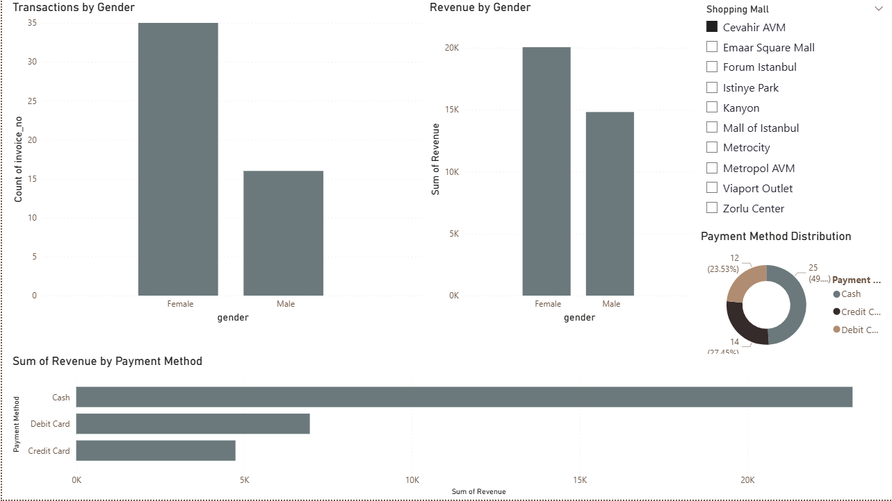
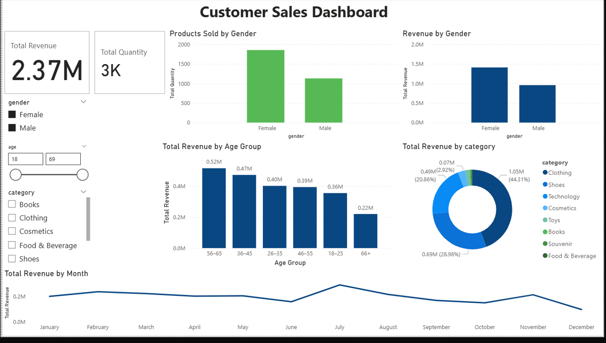

# Customer Data Analysis using SQL & Power BI

## Project Overview
This project analyzes real customer shopping data to understand buying behavior,
revenue patterns, product category performance, and payment method usage.

## Tools Used
- SQL
- Power BI
- Power Query
- DAX
- Excel

## Business Questions Answered
- How is the shopping distribution according to gender?
- Which gender did we sell more products to?
- Which gender generated more revenue?
- How is the shopping distribution according to age?
- Which age category generated more revenue?
- How is the distribution of the payment method?

## Author
Shaik Mezher Basha  
Email: shaikmezher@gmail.com  
LinkedIn: https://www.linkedin.com/in/shaik-mezher-57b287242/---

## 📊 Power BI Dashboards Preview

### 🔹 Overview Dashboard

### 🔹 Customer Demographics

### 🔹 Age Analysis

### 🔹 Gender & Payment Method Analysis

### 🔹 Category Performance

### 🔹 Sales Dashboard

